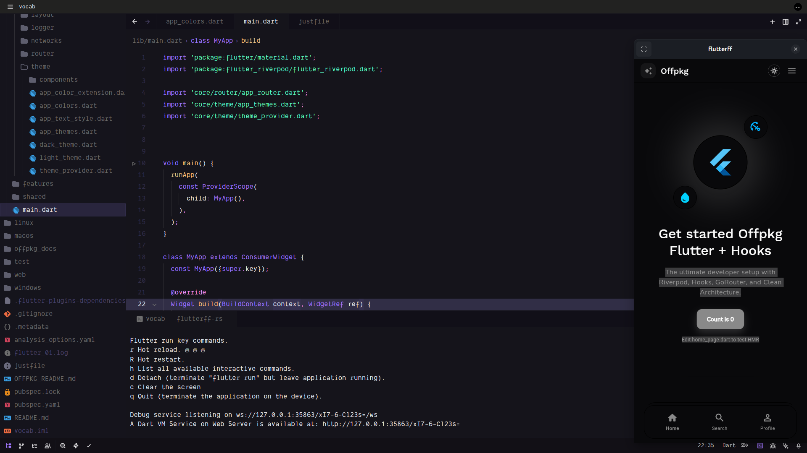
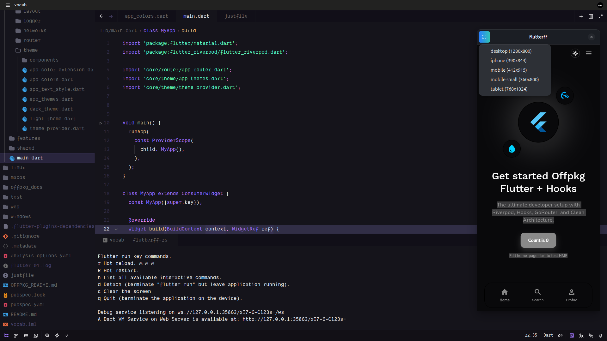

**A lightweight, ultra-fast Flutter Web development launcher for Linux.**

Native mobile window experience using GTK + WebKit2. No Chrome, no topbar, less RAM.

[](#)
[](#)
[](#)

---

## 🚀 Overview

**flutterff-rs** is a developer tool designed to bridge the gap between Flutter Web and a native mobile development experience. Instead of launching a full-blown Chrome instance that consumes gigabytes of RAM, `flutterff-rs` wraps your Flutter Web app in a minimal GTK window powered by WebKit2.

It mimics a real mobile device, providing quick access to common screen sizes and built-in controls for hot reloading, all while staying incredibly lightweight.

## ✨ Features

- **🛡️ Minimal RAM footprint**: Uses WebKit2GTK directly, avoiding the overhead of a full browser.
- **📱 Device Presets**: Instantly switch between common mobile, tablet, and desktop sizes on the fly with reliable native window resizing.
- **⚡ Integrated Hot Reload**: Dedicated lightning bolt button for Hot Reload ('r') and a refresh button for an instant UI Hot Restart.
- **📸 Native Screenshots**: Safe native Webview surface capturing via Cairo that writes full-fidelity snapshots straight to the `screenshots/` folder.
- **✈️ Offline Mode**: Auto-detects offline status and configures Flutter to use cached packages and local resources.
- **🎨 Custom Sizes**: Pass any resolution (e.g., `--size 430x932`) for precise testing.
- **🏗️ Zero Configuration**: Automatically finds free ports and hooks into your existing Flutter environment.

## 📸 Screenshots


*Main application window with Flutter Web content.*


*Quickly switch between device presets via the header bar.*

---

## 🏗️ Architecture

`flutterff-rs` acts as a sophisticated orchestrator for the Flutter CLI:

1.  **Process Management**: It spawns `flutter run -d web-server` as a child process.
2.  **Stream Interception**: It monitors the Flutter process's `stdout` to detect when the local server is ready and capture the URL.
3.  **Native Shell**: It creates a GTK3 window with an embedded WebKit2 WebView.
4.  **Signal Hooking**: UI buttons in the HeaderBar inject characters ('r') into the Flutter process's `stdin` for Hot Reload, and safely simulate Hot Restart ('R') natively via webview reloads.
5.  **Offline Logic**: It automatically adds `--no-pub` and `--no-web-resources-cdn` flags if no internet connection is detected, ensuring a smooth offline experience.

## 📂 Code Structure

The project is structured for simplicity and performance:

- **`src/main.rs`**: The core logic of the application.
  - **Argument Parsing**: Handles CLI flags and configuration.
  - **Threaded Execution**: Runs the Flutter process in a background thread to keep the UI responsive.
  - **GTK/WebKit**: Manages the native window and web rendering.
  - **IPC**: Uses Rust channels and GLib main loop integration to synchronize state between the Flutter process and the UI.
- **`install.sh`**: A comprehensive setup script that checks for dependencies (Rust, Flutter, GTK, WebKit) and handles compilation.

---

## 🛠️ Installation

### Prerequisites

You will need the following installed on your Linux system:

- **Rust**: [Install via rustup](https://rustup.rs/)
- **Flutter**: Ensure `flutter` is in your `PATH`.
- **Development Libraries**:
  - `libgtk-3-dev`
  - `libwebkit2gtk-4.1-dev` (or `4.0-dev`)

### Quick Install

Simply run the provided installation script:

```bash
chmod +x install.sh
./install.sh
```

The script will build the project in release mode and install the binary to `~/.local/bin/flutterff-rs`.

---

## 📖 Usage

Run `flutterff-rs` from the root of any Flutter project:

```bash
flutterff-rs [OPTIONS]
```

### Options

| Flag | Short | Description |
| :--- | :--- | :--- |
| `--size` | `-s` | Set window size (e.g., `mobile`, `iphone`, `768x1024`). |
| `--port` | `-p` | Set the web-server port (default: 8080). |
| `--offline` | | Force offline mode (skips pub get/CDN fetch). |
| `--no-hot` | | Disable hot reload functionality. |
| `--profile` | | Run Flutter in profile mode. |
| `--list-sizes` | | List all available device presets. |
| `--version` | | Show version information. |

### Example

```bash
# Launch with iPhone 13 dimensions
flutterff-rs --size iphone

# Launch with a custom tablet size
flutterff-rs --size 1200x800

# Force offline mode on a specific port
flutterff-rs --port 9000 --offline
```

---

Built with 🦀 Rust & 💙 Flutter
